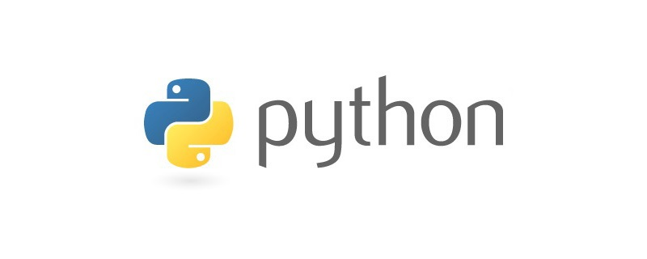

## 1. Functional and logic programming

- Free（Open source GPL）

- Cross platform

- Powerful(It can be embedded in C / + + programs which is often called glue language)

- Clear and elegant（zen of Python）

  ##### Application
  
  - Image recognition：Pig、Horse、bug、ship、face
  
    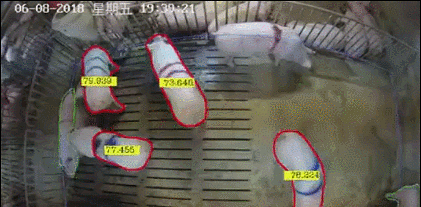
    
    <video src="./image/AI/horse.mp4" height="300" controls="controls">
    您的浏览器不支持 video 标签。
    </video>
    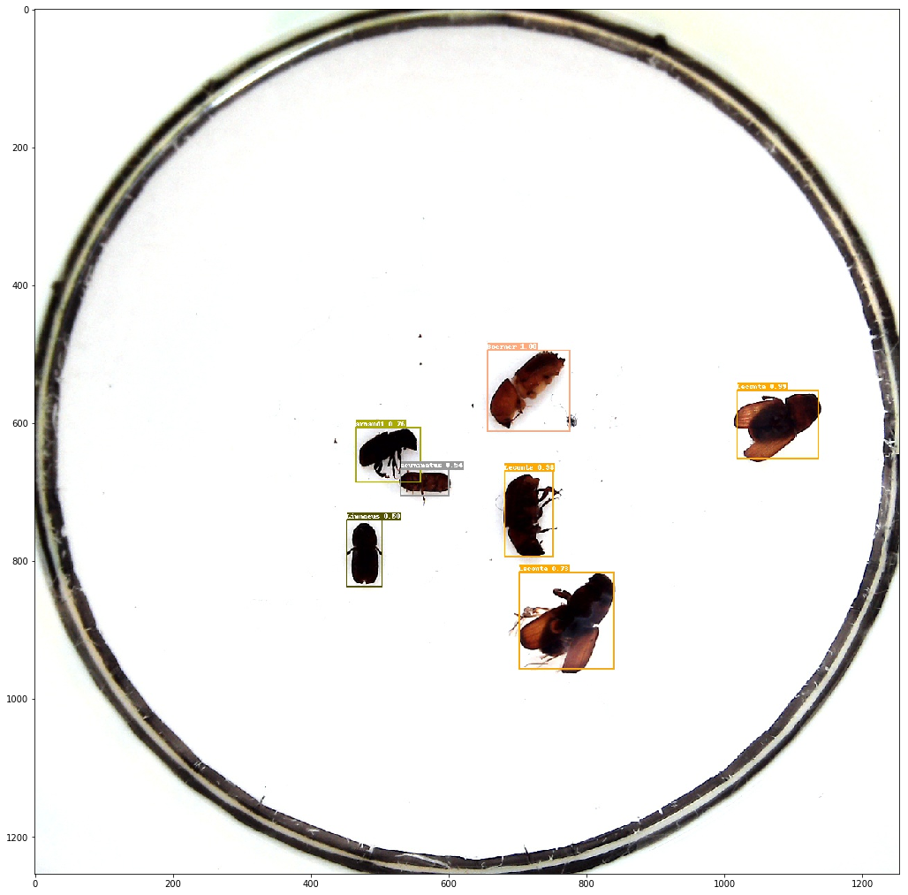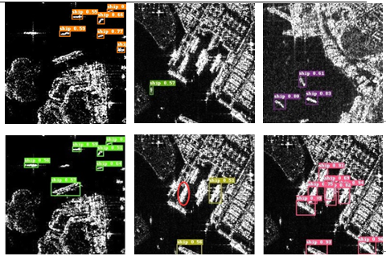
    
    <video src="./image/AI/jiewu1.mp4" height="300" controls="controls">
    您的浏览器不支持 video 标签。
    </video>
    
  - Face generation、Face synthesis
  
    ```
    https://aistudio.baidu.com/aistudio/projectdetail/2189795
    ```
  
    
  
    <video src="./image/AI/driving_video.mp4" height="200" controls="controls">
    您的浏览器不支持 video 标签。
    </video>
  
    <video src="./image/AI/result_with_music.mp4" height="200" controls="controls">
    您的浏览器不支持 video 标签。
    </video>
  
    
  - Generative Adversarial Networks: Create a new image or video which is not exist
  
    
    
    
    
    ```
    「 anime」：create cartoon pic
    http://www.thiswaifudoesnotexist.net/
    https://thisanimedoesnotexist.ai/
    「cat」：create cats pic
    http://thesecatsdonotexist.com/
    「 Airbnb 」：create room pic
    https://thisairbnbdoesnotexist.com/
    ```
    
  - music create
  
    ```
    https://aistudio.baidu.com/aistudio/projectdetail/2191339
    https://www.xfyun.cn/services/online_tts
    ```
  
  

### 1.1Environment installation

In Anaconda there are 2 version, 2.x   and 3.7. Python3  is better, it is more power

Version selected :  Python2 VS Python3 

IDE: integrated development environment

```
IDE needed:Anaconda Version:Python 3.8 • 64-Bit Graphical Installer 
Software download link：
https://www.anaconda.com/products/individual
```

<font color = 'red'>**Anaconda**</font>：An open source Python distribution，which contains a large number of tools.  And spyder、jupyterNotebook


Spyder：Run the script here, like Eclipse

jupyterNotebook： A web applications that allow creation and sharing. Support multiple programming languages such as Julia、R、Python、Octave.

First click Jupter Notebook label, and it will jump a website page. In this website ,we  select a path in our computer. In my computer I select Desktop/Code/Python/Py2021. You can select any path at will.

And select New/Python3 button/ then rename it --Lesson-1

interactive programming ：Run the code in cmd

Script programming：Run the script after switching paths ,python a.py

in cmd

```
for i in range(10):
    print(i)
    #double click enter
type quit()/exit() to exit interactive programming
```

Jupter NoteBook

​           - code sharing by email/Git

          - big data integration：spark、scala、scikit-learn、R、python

```
print("Hello world1")  
The difference between ctrl + enter, shift + enter and alt + enter
#ctrl + enter :the function is run the code 
#shift + enter :first run the code, in the same time, jump to the next code block
#alt + enter :insert a new block to write the python code
```

- export/import ipython file

```
export:share the file. Click File/ Download as / and then choose ipython file/ py
import: upload button/ find the file from others
```

- annotations 

```
#  If i want the code donot run for a signle line, we add annotation like this #

'''
If there are many line of content, we need add annotation. Multiline string
'''
```

Practice ：put out a Christmas tree

```
print("   *","  ***","*******","   |",sep="\n")
```


### 1.2 Overview of data types

Python standard data type

- String 

  ```python
  #1. The basic data type :String
  name = '123_abc' # signle line, the number ,letters,under score is ok to definite the string
  # '' signle quotation     ""double quotation,for multiline we use three quotation
  name2 =  '''
  david
  fly
  Russell
  '''          # multiline
  print(name, name2)
  # We can use type() function to check the data type
  print(type(name))  # str = string
  name3 = "His name is 'fly'"
  ```

  

- Numbers include int( 1,2) and float(1.0, 3.1415926)

  ```python
  #2. The basic data type :Number
  x1 = 1
  x2 = 10.0 #number
  #the defination of float is not the real number , it is much closer to this number
  print(type(x2))
  print((0.1 + 0.1+ 0.1+ 0.1+ 0.1+ 0.1+ 0.1+ 0.1+ 0.1)== 0.9)     #False
  #if we want to make a judgement (0.1 + 0.1+ 0.1+ 0.1+ 0.1+ 0.1+ 0.1+ 0.1+ 0.1) and 0.9
  print(0.9-(0.1 + 0.1+ 0.1+ 0.1+ 0.1+ 0.1+ 0.1+ 0.1+ 0.1) < 10 **-9 )  #True
  ```

- Bool :True/False，it is useful to make judgments

  ```
  #3. The basic data type :BOOL
  x3 = False == 1 # the real value of False is 0 in number(False == 0 )
  x4 = True == 0  # the real value of True is 1 in number(True ==1 )
  print(x3,x4)
  print(x3 * 5, type(x4))  # calculation
  ```

- List

  ```python
  #4. The basic data type :List
  #List is a range of data, inside of there are many kinds of data type,
  #such as string,number,list
  lst = [1,2,3,4]
  lst1 = ["a","b","c"]
  lst2 = [["Jack","Bob","Kite"],1,2,3,"a","b","c",[1,2,3]]
  print(lst2)
  #In list we can get the number by position, we call the position as index,
  #If we want to get 3, we can write like lst[2]
  print(lst[2]) 
  print(lst2[0][2])  #we need add another square bracket []
  ```

- Tuple 

  ```
  #5. The basic data type :Tuple
  #Tuple is also a range of data, but we can not change the value inside of it. 
  #So Tuple is a special kind of List
  tup = (1,2,3,4)  # not square bracke
  tup1 = 1,2,3
  tup2 = 1, 
  lis3 = [1,2,3,4]
  lis3[2] = 100
  #tup[2] = 100
  print(lis3)  # ctrl +enter
  print(type(tup))
  ```

- Dict

  ```
  #6. The basic data type :Dict
  #Dict  is a pair of value, it is  key and  value.
  #the key and value is unordered, we can not sort it
  dic1 = {"name":"Jack","age":19,"city":'peak',"hair":"black"}
  print(dic1,type(dic1)) 
  ```

- Type conversion(change int\float\ string are included, others will discussed later)

  ```
  val1 = 5 # int
  val2 = float(val1) #float
  val3 = str(val2)  #string  
  val4 = 5.5
  val5 = int(val4)  #change float to int
  print(type(val1),type(val2),type(val3),type(val5))
  ```

  Lesson 1 review:
  
  ```
  1.please describe the basic data type.
   a = 1.0   #number float
   a = 'my name is yan'  #String  ''signle quotation ""double quotation
   a = [1,2,3]   #  list  []square bracket 
   a = (1,2,3)   #  tuple () parentheses
   a = {"name":"Jack"} #dict {} curly brACE 
   
  2.what is the meaning of these function? 
    print()\  type()
    
  3.How to import/export/create a jupterNoteBook 
  ```
  
  


### 1.3 Basic knowledge

- 1.variable

> Variable value is not fixed，the equal sign is used to assign values to variables。The rules of variable name：
>
> 1.The first character of a variable name must be a letter Or underline(Upper case or lower case is ok)，It cannot start with a number
>
> 2.Variable name cannot be a keyword

```
#word = 4
#hello = 5
hello, world = 5,4  #add comma , maltivariable assignment
a = b = c = 1   # a =1; b=1; c=1
print(a,b,c,hello)
```

- 2. operator

```python
#operator +addition -substraction *multiplication / division
#+addition -substraction *multiplication / division
print(3+4-2*6/3)  #
# ** is the power of a value  2**3 = 2*2*2 =8 
print(5**3)
#// back slash Take the integer division  
print(8//3)   #
#% precent sign.   Modular operation -Returns the remainder of division
a = 21
b = 10
print(a%b)   #20 = 10 * 2 +1 
# calculate the equation 40 - 3 ** 2 +8/2**3 *10
print(8/2**3 *10)
#in 8/2**3 *10 , which part runs first? 8/2 or  2**3 or 2 *10

#**power//Take the integer division  %Modular operation -Returns the remainder of division

#Question: if i want to get 1,7,5 from 175, How to do?  
a = 175
print(a//100)       #1
print(a //10 % 10)    #print(int(135 /10 % 10))   print(135//10 -10)    #
print(a % 10) 

#compare calculation: > greater < lower <= greater equal 
# >= lower equal == equal  != not equal
print(5 != 3)

#logic calculation ---3 keyword:and or not
print( 3 > 2 and  4 <= 3 )  # both of them is true ,the result is true
print( 3 > 2 or  4 <= 3 )  # one of them is true ,the result is true
print(not 3 > 2)

#member operator: -- keyword: in / not in ,it is useally used in list and dict
ls = [1,2,3,4]
print(2 not in ls)
dict1 = {"name":"yan","age":18}
print("name" not in dict1)
```


```python
#Directional data ,It's not that the value of X has changed, but that the position pointed by X has changed
x = 1 # store 1 in c disk
print(x)
x = "hello world" #store "hello world" in d disk
print(x)
```


## 2. Python container

### 2.1 List

​	x = 1 means x is a variable, and its value is unique. When x = [1,2,3,4], it is a list. There are four elements in this list . Inside of a list there are many kind of data type, such as string/number/list etc.

```
list0 = [1,2,3,4]  # add 4 elements  in a sequence
list1 = [1,2,3,4,"hello","world",[5,6,7],1.3,5.4]
list1
```

- List common operation

```
#Link and repeat
x = [1,2,3]
y = [4,5,6]
#print(x+y, x*2)  #  link and repeat
# 2 function to control list : append, extend
x.append(y)  #append add a new element
print(x) #[1, 2, 3, [4, 5, 6]]
x.extend(y)
print(x)  #[1, 2, 3, 4, 5, 6]
#append modifiy the original list itself, whileise +create a new one [1,2,3]+['Jack']
```

​       Each element has a index, that is the element position. Get an element by specifying a subscript(index), or by specifying a range, you get elements for a set of sequences. This way of accessing sequences is called slicing.

```
list2 = [1, 2, 3, 4, 5, 6, 7, 8, 9]
list3 = [1,2,3,4,"hello","world",[5,6,7],1.3,5.4]
list4 = [1,2,[5,6,7],1,2,3,4,"hello","world",[5,6,7],1.3,5.4]
#print(list3[6][2])  #use position/subscript/index get the element
#print(list4[-2]) 
# if we use negative number , it count from right to  left, -1 is the last element
#slicing:add some colons , start : stop(limit) number : step
#the stop number is not included in this range
#print(list2[0:80:3]) 
#print(list2[2::])   # list2[0:10:1]
print(list2[-1::-1]) # count from right to left,parameters can be set as negative number
```


```
#some build-in function  len --length of a list
list2 = [1, 2, 3, 4, 5, 6, 7, 8,3] # '' is string
#print(len(list2),list2.count(3) )
#max , min , sum 
# these function are defined for the list of neumber only
print(max(list2), min(list2), sum(list2))
#index 
print(list2.index(3))
#The basic global function in list, it return the max,min,sun value of list 
#These function are defined for the list of numbers only
# .index(obj)：Find the index position of the first match of a value from the list
```

> ```
> Note：1.end_index is actually the index of the first object you don't want to get，so ls3[0:-1] can not get ls3[-1]. So if you want to get the element include end_index location，you donnot need to write end_index(ls3[::])，or enter a value that is outside the end_index range.
> 2.When the step is positive, indicating left to right.If step is negative, the range count from right to left 
> ```

```

#Question
x = [1,2,3,1,[1],[1,1],'1']
#what is the different between type(x[1]) and type(x[1:2])？ int vs list
#what is the value of x.index(1),x.count(1)？ # 0 , 2
```


```python
a = [1,2,3,['my','name'],'1']
print(a[3][1]) # print(a[-2][1])

#practice :  You can change the length at will，+ *
#1.a = [1,2,3] a = ['1','2','3'] different
 
#2.change a to [1,2,3,'Jack']  

#3. create a list m = [3,1,5,5,4,3,77,8] print the second and fourth element.
```


- List and generator(range)

```
#generator: it is comma , not colons , start : limit number : step
b = range(10)
c = list(range(10))
print(c)
```


```
Question:
    1. is the result of range() integer？  # yes
    2. create a range with 5 element， Use type() to check its type
    3. which grammar is correct？a = range(5) ，a = range(2:6),a = range(3,7) 
    4. if  b = range(10), what is the result of b[2],b[-2],b[5] 
```

- Insert and delete 

```
#remove an element
#c.remove(5)
#del is a sentence , slice
#del c[2:4] 
#c.clear() #clear the whole list
c.insert(1,"hello") #insert(index, value),index this the position of this list
print(c)
```

- Copy list

```
f = list(range(8))
#g = f
g = f.copy()  
#copy points to another new list
#the direct assignment points to the same list
g[1] = 100
print(f,g)
```


- Sort

```python
j = [3, 5, 100, 45, 4, 78, 56 ] # unordered list
k = ['abc','hello','solo','world']
#j.sort(reverse = False)  # ordered, numbers are arranged sequentially
k.sort() #letters are arranged in alphabetical order
m = sorted(j,reverse = True) 
#sort and copy a list, so j is not changed
print(j,m,k)
```

Lesson-2 review Question:

      1. what is the difference between sort and sorted?

```
m.sort()   -- modify the original list into an ordered sequence
sorted(m)  -- create a new list
```

​    2. create a list m = [1,2,4,1,1,3] , insert ["Jack"] between 4 and 1

```
m.insert(3,"Jack")
```

   3.m = [1,2,4,1,1,3] what is the difference between m.remove(2)  ,m.pop(2), del m[2]

```
m.pop() ,del m[2] is a statement, the result is same
```

  4 .what is the difference between append and extend?

```
append #  [1,2,3,[4,5,6]]  
extend #  [1,2,3,4,5,6] 
```

5. Input 3 int x,y,and z，please output these three numbers from small to large.

we need to use 2 function: input(), for i in range():

```
#first we define an empty list, when we insert a value, we append this value into the list, and then use sort function  
i = []
for k in range(3):
    a =  int(input("Please input the number here"))
    i.append(a)
i.sort(reverse = True) # try to output the value from large to small
print(i)
 
```


### 2.2  Tuple 

Tuple is a special list, of which  the value can not be changed

```python
a = (1,2,3,4)
b = 1,
c = [1,2,3]
del c[2]
#del a[2]  #'tuple' object doesn't support item deletion
#del a
#build in functions is ok : such as max , min , len,
print(max(a),min(a),len(a))
d = list(a)
d.insert(1,'abc')
print(d)
```


### 2.3 Dict

  Dictionary is another variable container model. it  can store any type of object. Keys must be unique, but values do not. In dict. In dict , key value pair is separated by colon, and each pair is separated by comma, whereas the dict is enclosed in curly braces.

```python
#dit In dict , key value pair is separated by colon, 
#and each pair is separated by comma, whereas the dict is enclosed in curly braces.
e = {'name':'yan','name12':['Jack'],(1,2):["hello"]}
#the key can be string/Tuple, but not be list,the value is string/list/dict
f = {'name':'yan','home':{'location':'Jakarta','email':'yan@google.com'}}
g = {'name':'yan'}
g['age']  = '30' #insert
g['name'] = 'Jack'  #update
del g['age']  #delete
g #query, find information inside of it , we just type its name
```

- Built-in functions in dict

```python
#Built-in functions in dict
dic1 = {'a':'1','b':'2'}
dic2 = {'c':'3','d':'4'}
dic3 = dic1.copy() #copy a new dict
dic1.update(dic2) #add the content, merge two dict together
print(dic1,dic2,dic3)
print(len(dic1)) #len
print('hello' in dic1) # in :determine if a dict contains this key
```

- Content reading in dict

```
dic4 = {'name':'yan','home':{'location':'Jakarta','email':'yan@google.com'}}
print(dic4['home']['location'])
print(dic4.get('home').get('location')) # dict.get()
print(dic4.values(),dic4.keys()) #

```


```
dic5 = {'name':'yan','age':'18','height':'180cm','hair':'black',
        'home':{'location':'Jakarta','email':'yan@google.com'}}
#use a loop , like for cycle
for i in dic5.values(): #here we output the values, try to output the keys 
    print(i)

for k,v in dic5.items():  #(k,v)
    print(k,v)  #print(v)
```


```
#practice: use input function, try to input 1,2,3    
#if you input 1  , the system output : 'you have input 1'
#if you input 2  , the system output : you have input 2
#if you input 3  , the system output : you have input 3
#if you input other number , the system output : you have input wrong number
info = {'1':"you have input 1",'2':"you have input 2",'3':"you have input 3"}
a = input("please input value here")
print(info.get(a)) #if user input other number,we need do judgement
```


### 2.4 Set

  Set is an unordered sequence of non repeating elements. You can create a set using braces {} or the set() function. 

```
basket = {"apple","orange","pear","apple","apple","apple"}  #set type
basket1 = set("pear")
print(basket1)
set1 = set("orange")# letters
set2 = {}  #it is dict type
set3 = set(("orange","pear","apple")) #words
print(set3)
```

calculate set

```
set4 = {"a","b","c","d"}
set5 = {"e","f","c","taobao"}
#print(set4 ^set5) # | or & and ^ only in set 4 or in set5 
set5.add("google")#add element
set5.remove("c")#remove element
set5.discard("c")#remove element,even the element does not exist, there is no error
set5.pop() #randomly delete an element,takes no arguments
print(set5)
```


## 3. Control flow 

### 3.1 Sequential structure

Sequential structure means that the code is executed from top to the bottom without branches or loop  

### 3.2 Branching structure

- if statement

```python
#multi conditions we use or/ and 
age = 29
if (age >18 and age < 22) or (age >24 and age < 30): 
    print("you are old enough to be an university student")
else:
    print("you are old enough")
  # if statement must be followed by a colon ： 
  # automatically indent: For consistency, we always use four spaces to indent a block
  # when if statement finished. Code return to the original indent, continue writing
  # Indentation rules in Python：Code with the same indentation is considered the same block
```

Question： Find the prime number in 1-15

Rule: Find a number, divide 2 to sqrt (this number) by a number. If it can be divided by an integer, it indicates that this number is not a prime number. Otherwise it is a prime number.

for example: 6 can be divide by 3

```
from math import sqrt
leap =1　
for i in range(1,15):
    k = int(sqrt(i+1))
    for j in range(2,k+1):
        if(i % j == 0):
            leap =0
            break
    if(leap ==1):
        print(i)
    leap =1 
```


### 3.3 Cycle structure

- for cycle

```python
#For cycle is  a loop , we can get all the elements from a sequence,such as list/dict
lst = list(range(5)) # 0,1,2,3,4
#1 in range:range(start,stop,step)   default value for start is 0;if there is only 1 parameterx the int list value sorted from o to x-1; step is the growth value of each cycle sequence
# 2 in list
for i in lst[::2]: #slicing
    print(i)
```


```python
# 3in dic
dic1 = {'Tom':'18','Jack':'19','Alex':'20','Mary':'21'}
for i in dic1:
    print(dic1[i])
```


```python
for i in range(3):  #underline is ok
    for k in range(2):  #nest loop, circulate embedding method
        print(i,k)   #we should not use nest loop too much, no more than 3 time 
```

#practice: 

1.write a for cycle ,try to output even number which is no more than 10
#0,2,4,6,8

```
for i in range(10):
    if  i % 2 ==0:
        print(i)
print("That is the even number")
```

2."Narcissistic number" is a three digit number， The sum of each digit cube is equal to the number itself. 

For example , 153 is a narcissistic number，because 153=1* * 3＋5 * *3＋3**3. And 3 raised to the power of 3 is 27， 125 is the cube of 5.

Please get all the "Narcissistic number" from 100 - 1000

```
for i in range(100,1000):  #IF I = 153
   a = i // 100  #1
   b = i %10 // 10 #5
   c = i%10 #3
   if(a**3 + b**3 + c**3 == i):
       print(i)
```


- while cycle

while cycle construct a structure similar to an infinite loop or use it in a loop with an uncertain times.

```
count = 0
while count < 10:
    print("The count is ",count)
    count = count+1
print("Good bye",count)
#  count < 10is a judgement statement, when the result is true. 
#It will get into the function body and countinue to run
```


```python
# Infinite loop：if a judgement statement never change to false，The loop will execute indefinitely
# we must aviod infinite loop
var =1
while var == 1:
    num = input('enter the number here')
    print('you entered ',num)
    
# while-else
#while-else === the same as if-else
count = 11
while count < 10:
    print("The count is ",count)
    count = count+1
else:
    print("The count is greater than 10",count)
```


Practice：

1. Output all even number which is less than 10

```
i = 1
while i<10:
    i +=1
    if i%2 ==0:
        print(i)
```


- Loop control statement

The **break ** statementends the current loop and jumps to the statement immediately following the loop.

**Continue** ends the current interation and jump to the top of the loop and starts the next interation.

**pass** is an empty statement, it keep the integrity of the program structure 

```python
# 1.break statement:So break will terminate a loop
s = 0
n = 1
while n > 0:
    s = s+n
    n = n+1
    if(n == 5):
        break
        print('abc')
print(n,s) 
# nested loop
s = 0
for  i in range(10): #i
    for j in range(5):
        print(i,j)
        s = s + (i*j)
    if s > 20:
        break #break statement stop execution of the deepest loop
        #and start executing the next line of code
#2 continue
i = 1
while i<10:
    i +=1 # i =4
    if i%2 ==0:
        print("it is even number",i)
    else:  
        continue#i =3
# countinue tell the programme to skip the remaining statement of the current loop
#and then proceed to the next cycle
        print("it is odd number",i)
#3 pass
for  letter in 'welcome':
    if letter == 'm':
        pass # it neither break nor skip the loop
        print("the current letter is m")
    print("the current letter is ",letter)
print("Goodbye")
```

practice:

1. run the code below on your computer, and see the result  

```
s = 0
for i in 'helloworld,hello Jakarta':
    if i == 'w':
        pass #try to continue to see what happened
        print('now it is w，but I pass')
    elif i == 'd':
        print('now it is d，but I break')
        break
    print('now it is %s'%i)
print('The end')
```

2.Try to find all the even number in 1-20, and calculate the sum of all the even number

```

```

### 3.4  Flow chart 

PyFlowchart is a package to：

- write flowchart in Python,
- translate Python source codes into flowchart.

https://github.com/seflless/diagrams#flowchart

https://gitee.com/cdfmlr/pyflowchart#https://github.com/francoislaberge/diagrams/#flowchart

**step1**: install the third-part package:pip3 install pyflowchart


**step2:** define python code ,store it on the desktop change py into flow chart syntax  ,  

```sh
python -m pyflowchart test.py
```

```flow
op2=>operation: s = 0
cond5=>condition: for i in range(10)
cond38=>condition: for j in range(5)
sub47=>subroutine: print(i, j)
op49=>operation: s = (s + (i * j))
cond54=>operation: break if  (s > 20)

op2->cond5
cond5(yes)->cond38
cond38(yes)->sub47
sub47->op49
op49(left)->cond38
cond38(no)->cond54
cond54->cond5
```

**step3:** change language type into flow

```flow
st=>start: Start
op=>operation: Your Operation
cond=>condition: Yes or No?
e=>end

st->op->cond
cond(yes)->e
cond(no)->op
```


## 4. Strings

```python
#signle quotation/ double quotation
#Escape character
# \" double quotation, \' single quotation, 
#\n create a new line,the cursor move to the head of new line
# \\ back slash        \t tab key,auto-indents 
print(r"D:\Course")  # means remov escape character
a = "hello world"
print(len(a))
```


```python
#replace
a =  'I\'m perfect good,good,good,enough'
b = a.replace('good','perfect',2) 
#replace(old,new,count) the third parameter is an optional parameter
#it indicates how many times it changes

#
#split(obj)
d = '00001_01_01_109.png '
c = d.split('_')   # change string type into list

#join(list), connect the list into string
e = '\\'.join(c)
print(c,e)
```


```python
f ='helloworld      '
print(f.rstrip())
#startswith()   #isalpha
#Judge the beginning or end:startswith，endswith
#isalnum contain 0-9 letter，upper,lower，swapcase,
#capitalize,isnumeric,isalpha,rstrip :delete trail space
```


```python
#Format character, insert variable in string
today = 9.23
tomorrow =  '9.24'
print("today is %.3f ,tomorrow is %s"%(today,tomorrow))
#   %s-  string, %i- int ,%f-  float ,%e- scientific counting method   
print("{} is perfect".format('Daniel'))
print("{0},{2},{1} is perfect".format('Daniel','David','Julina'))
```


pratice:

-  what is the output ：33+"22"; 33+int("22"); "22" + str(55);
-  m=“a,b,c”,m.split() what will happen？（without ","）
-  what is the output type of .split and .join 
-  If I need to output %f, how to do？
-  print("abc%s") % "nn"  #print("abc%s" % "nn")
-  print(245%f % 123)  # '245%f'%123
-  How to change the filename from   00001_01_01_109.png  into   00001_01_01/109.png

Lesson-review:

 3keywords, break\Continue\pass

string:split\join 000002_03_01

## 5. Functions

### 5.1 Basic concept of functions

In the process of programming, the repeated statements can be extracted and written as functions, which makes the program structure clear and easier to maintain.

- Basic function

```python
def functionName(params): #colon must be written
    block                 # function body
    return  value/expression #return is optional,return statement exit the function and get a expression. If a function donot have return statement,it will return None, that means return None/return
```

- return statement

```python
def f1(x):
    y = 2 ** x
def f2(x):
    y = 2 ** x
    return y
print(f1(2))
print(f2(2))
```

- parameter

```python
def hello(name,age):
    print(name+" is "+str(age)+" years old")
hello("Jack",18)

#default parameters
def hello(name, age= 18):
    print(name+" is "+str(age)+" years old")
hello("Jack",19) 

#practice
def mult(x, y= 2):
    return x*y
mult(2,3)
mult(2) #default parameters is 2, if you do not give a new value, 2 will previal

#variable parameters:If there are serveral parameters 
#or the number is uncertain,we can use * instead
def f(*x):
    print(x)
    return x  #tuple
f("2","2",["abc","def"])
```


```python
# Guessing numbers: The requirements are as follows：
# Randomly generate an integer in 0-100
# Guess a number and enter it,Judge whether it is big or small until you guess correctly
import random
import math
y = random.random()*100  #0-100
z = math.ceil(y)    #int type
def Guess():
    while True:
        x = int(input("please input your number x = "))
        if x ==z:
            print("Right")
            break
        else:
            if x > z:
                print("Too big")
            else:
                print("Too small")
    print("Congratulation")
Guess()
```

### 5.2 Local and global variables

variables define inside of function is local variables, it has local  scope. variables define outside of function is global variables, it has global scope. local variables can be only used inside of a function, while  global variables can be accessed throughout the program

```python
a = "abc"  #global
def f(x):
    global a  #global
    a = "hello everyone" #local
    print("local variables in function %s"%m)
f(a)
print(a)


#1Fibonacci sequence is a sequence like this：[0, 1, 1, 2, 3, 5, 8, 13, 21, 34, 55....]
#That means F[a] = F[a-1] + F[a-2], Try to get the top 5 values in Fibonacci sequence 
#F0 = 0     (n=0)    #F1 = 1    (n=1)      #Fn = F[n-1]+ F[n-2](n=>2)
def fib(n):
    if n==1:
        return [1]
    if n==2:
        return [1,1]
    fibs = [1,1]
    for i in range(2,n):
        fibs.append(fibs[-1]+fibs[-2])
    return fibs
print(fib(5))

#Answer 2：
def fib(n):
    a,b =1,1
    for i in range(n-1):
        a,b = b,a+b
    return a
for i in range(1,8):   
    print(fib(i))
#Answer 3：Recursive function
def fib(n):
    if n==1 or n==2:
        return 1
    return fib(n-1)+fib(n-2)
print (fib(10))
```

### 5.3 Anonymous function( lambda )

```python
def fun(a,b,c):
    return a+b+c
print(fun(1,2,3))
#lambda expression / Anonymous function
f = lambda a,b,c:a+b+c 
#lambda is not requie function name, the body of lambda is an expression
#It only has one line, only the limited logic can be written in lambda expression
print(f(1,2,3))
```


practice:

①Create an anonymous function to find the number of elements 

```python
list1 = [1,2,3,45,7,89,0] #7    length
f1 = lambda lst:len(lst)
f1(list1)
```

② Define a function to sort all input numbers from large to small

```python
# sort   sorted
f2 = lambda lst:sorted(lst,reverse=True)
f2(list1)
```


### 5.4 Others

#### 5.4.1 Common built-in functions

```python
list1 = [1,2,3,45,7,89,0]
help(abs)  #
abs(-1) #Return the absolute value of the argument.
print(max(list1),min(list1),sum(list1))
sorted(list1) # 
len(list1)
round(3.1415926,4) #get the float number in fixed length
divmod(12,3) #return the division and remainer  (x//y, x%y) 
```

#### 5.4.2 Line function

 Line function is also called list parsing or list comprehension，the structure is as followed:

```
[expression1 for k in if expression2]
```

```python
#line function  [expression1 for k in if expression2]
list2 = [1,2,3,4,5]
a = [k+2 for k in list2 if k%2==0]
print(a)
[(x,y) for x in range(3) for y in range(3)] #more limitation
```

#### 5.4.3 filter

filter(function(),s) 

```python
#filter get each of element in list and assign to function, 
#it can be used to filter list then return the result as a new list
def is_odd(n):
    return n%2 ==1
list(filter(is_odd,[1,2,4,5,6,9,15]))
```

#### 5.4.4 Map

Map get each of element in list and assign to function,  And then return the result as a new list

```
def is_odd(n):
    return n%2 ==1
list(map(is_odd,[1,2,4,5,6,9,15]))
```

map return the result, however filter get out data for scope

####  5.4.5 reduce

```
reduce(f,[x1,x2,x3,x3]) =f(f(f(x1,x2),x3) ,x4)
```

```
from functools import reduce
def add(x,y):
    return x+y
reduce(add,[1,2,3,4]) # add(1,2) = add(3,3) = add(6,4)
```


pratice:

```python
#Q1：In 1, 2, 3 and 4 . How many different two digits can be formed without repeated numbers, like 12\23\13\34...? How much is it?

#Q2:Input three integer x, y and Z. please output these three numbers from small to large. 
#limitation:You need to  use input\isdigit function. (judge whether the input data is a number)
```


## 6. Object Oriented Programming Foundation 

Object Oriented Programming(OOP) is a programming method through defining functions to simulate the real world. OOP can control data in a reasonable and automatic way, reducing code bug, reducing code quantity,  and easier to maintain.

### 6.1 Define a class

We can use classes to define and represent models with the **same** **attributes** and **capabilities**, the structure is as followed:

```
class <ClassName>:
```

We call  **attributes** as property/attribute and **capabilities** are method/function.  for example,  a person has properties like height, age, name, and he can run/eat/smile.

The methods in the class are basically the same as the functions in lesson 5. But there are some differences：

1. The first parameter of the method must be ’self ‘，and cannot be omitted(when we use method we do not need to provide the self parameter)；
2. Method calls need to instantiate a class.  And in the form of instance name. method name (parameter list);
3. The overall indentation indicates the content belonging to the class.

```python
class MyClass:
    def info(self):
        print('The class I defined')
    def mycalc(self,x,y):
        return x+y
mc = MyClass()
mc.info()
print(mc.mycalc(3,5))
```

#### 6.1.1 Class Properties

There are two types of properties：

- Instance properties ：Different instances values  of the same class are not associated，'self. attribute name' is used when defining and when calling.
- Class properties ：common to all instances

```python
class Demo_property:
    class_name = "Demo_property"     #Class properties,as long as an instance modifies it, it will affect all other instances
    def __init__(self,x=0):          #__init__ is a special function, we can call it init function/constructor. When a instance is created, it will be called automaticlly
        self.x = x                   #Instance properties，it will not affect others
    def info(self):
        print(Demo_property.class_name) #Class properties value
        print(self.x)                   #Instance properties value
    def change1(self,x):
        self.x = x
    def change2(self,name):
        Demo_property.class_name = name
    def change3(cls):
    	print('change3 %s'%cls.bar)
    	cls().info()    #call info function
dpa = Demo_property()
dpb = Demo_property()
dpa.info()
dpa.change2("3")
dpa.info()
```

- Python built-in class properties

  - __ name__ is  class name
  - __ module__ is  class module

  - __ dict__  is  class properties

```python
class Demo_property:
    class_name = "Demo_property"     #Class properties,as long as an instance modifies it, it will affect all other instances
    def __init__(self,x=0):          #__init__ is a special function, we can call it init function/constructor. When a instance is created, it will be called automaticlly
        self.x = x                   #Instance properties，it will not affect others
    def info(self):
        print(Demo_property.class_name) #Class properties value
        print(self.x)                   #Instance properties value
    def change1(self,x):
        self.x = x
    def change2(self,name):
        Demo_property.class_name = name
    def change3(cls):
        print('change3 %s'%cls.bar)
        cls().info()    #call info function
print(Demo_property.__name__)          #
print(Demo_property.__module__)
print(Demo_property.__dict__ )
```

practice：

1. What is the following code output,why

```python
class People(object):
   def __init__(self):
       print("__init__")
   def __new__(cls, *args, **kwargs):   #__ new__ () usually returns an instance of this class,   change name to new1 
       print("__new__")
       return object.__new__(cls, *args, **kwargs)
People()
```

2. supplementary code to performs the following methods class_foo/static_foo

```python
class A(object):
   def foo(self, x):
       print("executing foo(%s, %s)" % (self,x))
   @classmethod
   def class_foo(cls, x):
       print("executing class_foo(%s, %s)" % (cls,x))
   @staticmethod
   def static_foo(x):
       print("executing static_foo(%s)" % (x))
a = A()
a.class_foo('data1')  #result：executing class_foo(<class '__main__.A'>, data1)
A.class_foo('data2')  #result：executing class_foo(<class '__main__.A'>, data2)
```

3. Write a Student Class that requires counter attribute . It can count the total number of students instantiated

```
class Student:
    count = 0
    @classmethod
    def __init__(cls):
        cls.count += 1
a1 = Student()
a2 = Student()
a3 = Student()
a4 = Student()
print(Student.count)
```


#### 6.1.2 Extends

Subclasses cannot inherit private properties and private methods of the parent class（Prefixed with two underlines）， Subclasses can overload the methods of the parent class , it can  achieve different  representations or capabilities of the parent class. 

```python
class Dog:
    def __init__(self,x=0,y=0,color='yellow'):  #constructor
        self.x = x
        self.y = y
        self.color = color
    def crawl(self,x,y):
        self.y = y 
        print('The current position:(%d,%d)' % (self.x,self.y))
    def attack(self):
        print('Use teetch')
class Haski(Dog):                         #Extends
    def attack(self):                     #Method overloading
        print('Use teetch and Smile')
haski = Haski(color='white')
haski.crawl(3,8)
haski.attack()
```

Multiple inheritance ：class Sub(Dog, Haski)

#### 6.1.3 Member methods and static methods

- Instance method, All previous class methods are instance methods
- Class method，It can be called directly by the class name or by an instance.  annotation @classmethod
- **classmethod** functions do not need to be instantiated，do not need self . However, the first parameter needs to be the cls , representing its own class, which can call the properties, methods and instantiated objects. 

```python
class Demo_property:
    class_name = "Demo_property"     #Class properties,as long as an instance modifies it, it will affect all other instances
    def __init__(self,x=0):
        self.x = x                   #Instance properties，it will not affect others
    def info(self):
        print(Demo_property.class_name) #Class properties value
        print(self.x)                   #Instance properties value
    def change1(self,x):
        self.x = x
    def change2(self,name):
        Demo_property.class_name = name
    @classmethod
    def change3(cls):
        print('change3 %s'%cls.class_name)
        cls().info()    #call info function
Demo_property.change3()
```


- Static method，It can be called directly by the class name @staticmethod
- This method does not force parameters to be passed

```python
class Demo_property:
    class_name = "Demo_property"     #Class properties,as long as an instance modifies it, it will affect all other instances
    def __init__(self,x=0):
        self.x = x                   #Instance properties，it will not affect others
    def info(self):
        print(Demo_property.class_name) #Class properties value
        print(self.x)                   #Instance properties value
    def change1(self,x):
        self.x = x
    def change2(self,name):
        Demo_property.class_name = name
    @staticmethod
    def change3(arg1):
        print('change3 %s'%arg1)
        
Demo_property.change3('hello')
```

practice：

1. What is the following code output,why

```
class Parent(object):
  	x = 1
class Child1(Parent):
    pass
class Child2(Parent):
    pass
print(Parent.x, Child1.x, Child2.x) 
Child1.x = 2
print(Parent.x, Child1.x, Child2.x)
Parent.x = 3
print(Parent.x, Child1.x, Child2.x)
```


### 6.2 Module creation and introduction

- When the program is simple,we can write the code in a file
- When the code is too long or too large, you need to put the project into different files according to function.  Different code files are different modules（Each py file is a module）
- When the  code complexity get increased, you need to put different codes into different folders, and they can refer to each other, that is package.

Module is a python file end with .py，it contains Python object definitions and statements

```python
def f1(n):
    y = 1
    for i in range(1,n+1):
        y = y * i
    return y
# Create factorial function f1(n)

def f2(lst,x):
    while x in lst:
        lst.remove(x)
    return lst
# Create a function can delete element in list,  f2(lst,x)

def f3(a,d,n):
    an = a
    s = 0
    for i in range(n-1):
        an = an + d
        s = s + an
    return s
# Create a summation function f3(a,d,n)
# Create a module 'testmodel2'，it include three functions
```

- Call module

```
import testmodel2
# Call the module directly with import   print(testmodel2.f1(5))   
print(testmodel2.f2([2,3,4,5,5,5,6,6,4,4,4,4],4))
print(testmodel2.f3(10,2,10))

```

Simplified module name ：import...as..(import testmodel2 as tm2)

Call some module statements ：From…import (Some functions of modules are imported separately, but other functions are not imported)

```python
# python standard module —— random number
import random
x = random.random()
y = random.random()
print(x,y*10)
# random.random() [0:1) 
m = random.randint(0,10)
print(m)
# random.randint()  [0:10] 
st1 = random.choice(list(range(10)))
st2 = random.choice('abcdnehgjla')
print(st1,st2)
# random.choice() Randomly get an element in (), which must be an ordered type
lst = list(range(20))
sli = random.sample(lst,5)
print(sli)
# random.sample(a,b)   Randomly obtain a fragment with the of b in a, without changing the original sequence
lst = [1,3,5,7,9,11,13]
random.shuffle(lst)
print(lst)
# random.shuffle(list)Scramble elements in a list
```

### 6.3 Package

A package is a folder or directory ，it must contain a  _init _.py file，However, any part of the import package will execute the file, and the variables and functions will be imported automatically

### 6.4 Closure function

- Closure is the object obtained by packaging the function  statements and the execution environment of these statements. 
- Using closures can flexibly implement other functions that are not easy to implement in syntax

Practice： change image to text file

```
#!/usr/bin/env python
# coding: utf-8

import numpy as np
from PIL import Image

if __name__ == '__main__':
    image_file = '3.jpg'
    height = 100#change image height to 100

    img = Image.open(image_file)
    img_width, img_height = img.size
    width = 2 * height * img_width // img_height    
    img = img.resize((width, height), Image.ANTIALIAS)#change image size
    pixels = np.array(img.convert('L')) 
    print(pixels.shape)
    print(pixels)
    chars = "MNHQ$OC?7>!:-;. " #256 color,M means 0-15，N means 16-31
    N = len(chars)
    step = 256 // N
    print(N)
    result = ''
    for i in range(height):
        for j in range(width):
            result += chars[pixels[i][j] // step]                          
        result += '\n'
    with open('text.txt', mode='w') as f:
        f.write(result)
```

Lesson6 - review:


## 7. File and Exception

excel /CSV/txt

### 7.1 Document declaration and basic operation

```python
import os   #operating system
#    \t    escape character
path1 = r"C:\Users\everi\Desktop\Code\Python\Py2021"         #We use r to prevent character escape
path2 = "C:\\Users\\everi\\Desktop\\Code\\Python\\Py2021"    #2 back slashes \\
path3 = os.path.dirname(os.path.abspath('__file__'))          #directory 
print(path3)
```

- read / write something in the txt file

```python
path4 = "C:\\Users\\everi\\Desktop\\Code\\Python\\Py2021\\hello.txt"    #2 back slashes \\
f = open(path4, 'r')  #mode:  r means read, w means write,  encoding ='utf8'
#print(type(f))
#print(f)
print(f.read())#output the content, after this cursor is in the end of file 
print("reading completed")
f.seek(0)  #move the cursor to the begining of the file
print(f.read())
f.close()  #close the IO operation
```


### 7.2 System module path 

```python
import os   #operating system
path5 = "C:\\Users\\everi\\Desktop\\Code\\Python\\Py2021"         #directory 
#print(os.name)  #nt means windows, Linux/unix 'posix'
#print(os.listdir())  #file and directory name
#print(os.getcwd())  #current work directory
#os.remove('a.txt')
print(path5)
os.chdir(r'C:\Users\everi\Desktop\Code\Python')  #change the directory to a target directory
print(os.getcwd())  #current work directory
print(os.path.exists(r"C:\Users\everi\Desktop\Code\Python\Py2021\hello.txt")) 
print(os.path.split(r"C:\Users\everi\Desktop\Code\Python\Py2021\hello.txt"))
# return the directory name,and file name
```

### 7.3 Files reading and writing 

-  Files reading
   -  read()  output the content, after this cursor is in the end of file
   -  readlines()  get the content line by line

```python
#File reading 
path6 = "C:\\Users\\everi\\Desktop\\Code\\Python\\Py2021\\hello.txt" #2 back slashes \\
f = open(path6, 'r')  #mode:  r means read, w means write,  encoding ='utf8'
f.seek(0)
#print(f.readline(4))  #first 4 characters of a line
#print(f.readlines())
for line in f.readlines():
    print(type(line),line)
```

-  Files writing 
   -  write()  write string into the file
   -  writelines()  list into the file 

```python
#File writing 
path7 = "C:\\Users\\everi\\Desktop\\Code\\Python\\Py2021\\test.txt"    #2 back slashes \\
#create an empty file 'test.txt',and add the content "hello world" inside of it
f = open(path7, 'w',encoding ='utf8')  #change the mode
f.write("hello world")
f.close() #close writing operation
print("finished")
```


```python
path8 = "C:\\Users\\everi\\Desktop\\Code\\Python\\Py2021\\test.txt"   
f = open(path8, 'w',encoding ='utf8')  
lst = ['a','b','c','d','e']
f.writelines(lst)
f.close() #close writing operation
print("finished")
```

practice:

1. write a file. the style is line by line. 

    ['a\n','b\n','c\n','d\n','e\n'] this kind is a little complex, we can use for loop to write the content line by line

```python
path9 = "C:\\Users\\everi\\Desktop\\Code\\Python\\Py2021\\test.txt"   
f = open(path9, 'w',encoding ='utf8')  
lst = ['a','b','c','d','e','f'] 
for i in range(len(lst)):  #0 to 4
    lst[i] = lst[i]+'\n'  # change style from ['a','b','c','d','e']  to ['a\n','b\n','c\n','d\n','e\n']  
f.writelines(lst)
f.close() #close writing operation
print("finished")
```

2. There are 2 list [1 to 10 ], [a to j]. Please write a out.txt file to make the content format like this:

```
1,a
2,b
3,c
.....
10,j
```

```python
path10 = "C:\\Users\\everi\\Desktop\\Code\\Python\\Py2021\\out.txt"   
f = open(path10, 'w',encoding ='utf8')  
lst1 =  list(range(1,11))  #
lst2 =  ['a','b','c','d','e','f','g','h','i','j']
for i in range(len(lst1)):  #10 elements
    out = [str(lst1[i]),',',lst2[i],'\n'] 
    f.writelines(out)
f.close() #close writing operation
print("finished")
```

- with statement

With statement can ensure the clear up IO operation, it will automatically close the IO operation

```python
os.chdir(r'C:\\Users\\everi\\Desktop\\Code\\Python\\Py2021\\')  #change the directory to a target directory
with open('test.txt') as file:
    data = file.read()
    print(data)  #automaticlly close the IO operation
#style 2
try:
    f = open()
except:
    exit(-1)
finally:
    f.close()
```

### 7.4 pickle

- store

```python
import pickle
data = {'a':[1,2,3,4],'b':('hello','world'),'c':'word'}
path11 = "C:\\Users\\everi\\Desktop\\Code\\Python\\Py2021\\data.pkl"   
f = open(path11, 'wb') #mode: w  wb  , write binary
pickle.dump(data,f)
f.close()
#dump
```

- read

```python
#load function
f = open(path11, 'rb') #mode:rb   read binary
st = pickle.load(f)
print(st)
print('finished')
```


## 8. Common packages

### 8.1 Numpy

​	 Numpy is the basic python programming library .  It provides advanced mathematical operations, it also has a very efficient vector matrix operation function 。


### 8.2 Pandas

```

```


### 8.3 Matplotlib


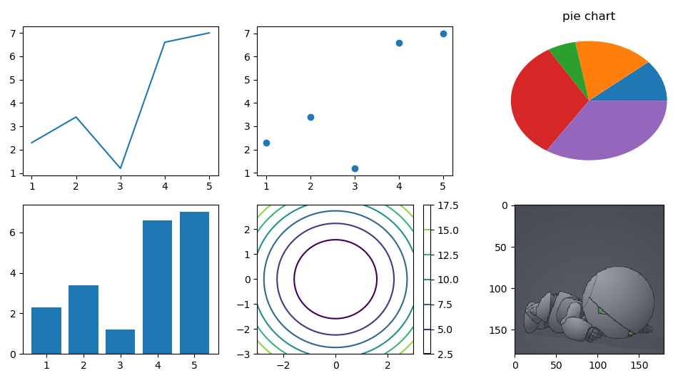

## 9. Application

### 9.1 Medical CT Image Data Analysis

​	Computed Tomography（CT）plays an important role in clinical diagnosis. It has the characteristics of high speed, high accuracy and good repeatability . Doctors can make a diagnosis of the patient's condition and give a treatment plan through CT images. Most of the current medical detection research tasks are designed for single task learning, of which the detection function is often only for a specific part of lesion detection. 

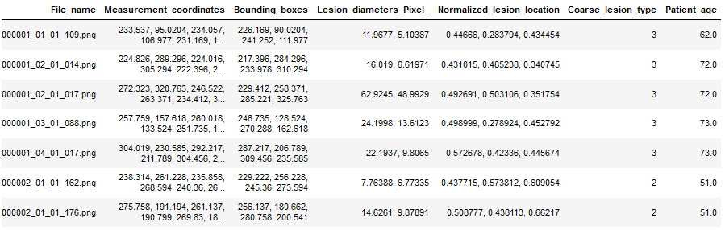

​	There are 8 kinds of lesions: lung, abdomen, mediastinum, liver, pelvis, soft tissue, kidney and bone

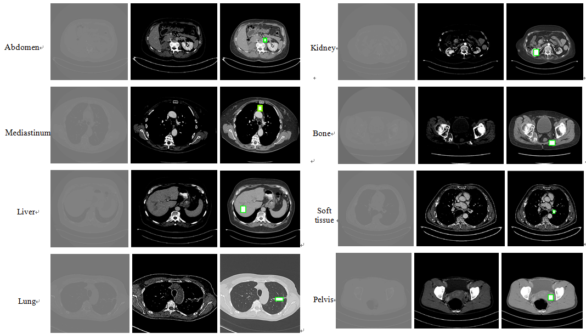

​	Most complex learning problems are usually decomposed into simple and independent sub-problems, and then the results are combined to get the results of the original problem. In this way, the association information between problems is ignored and the generalization effect of the model is weakened . In the actual clinical diagnosis, it will be found that many lesions are actually related, and the detection of a single part is not conducive for the doctor's comprehensive diagnosis. The detection of multi-site lesions can detect the metastasis of lesions earlier. At the same time, it can excavate the relationship between different lesions .

​	

​	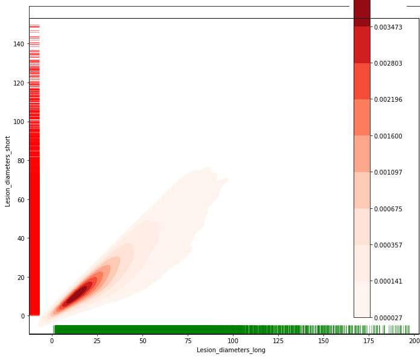

​       We choose the combination of siloette coefficient and SSE to select the optimal K value. The specific method is to let K value from 1 to the appropriate upper limit of 16, and cluster each k value and record the corresponding SSE.


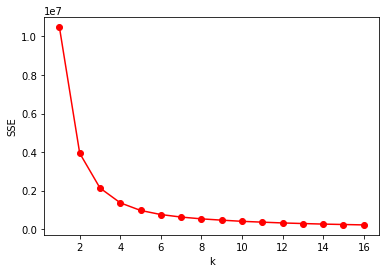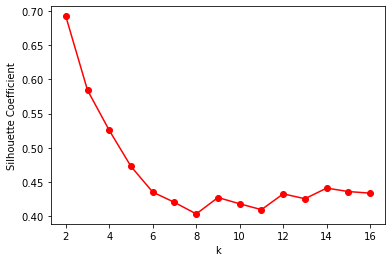

### 9.2 User behavior analysis

```
# 引入必要的包
import pandas as pd
import numpy as np
import seaborn as sns
import matplotlib.pyplot as plt
from sklearn import preprocessing
```

```
# 多变量关系
sns.pairplot(sample_data, hue='Attrition', vars=['Age', 'MonthlyIncome', 'NumCompaniesWorked', 'PercentSalaryHike',
                                               'TotalWorkingYears', 'TrainingTimesLastYear', 'YearsAtCompany', 'YearsInCurrentRole',
                                               'YearsSinceLastPromotion', 'YearsWithCurrManager'])
```

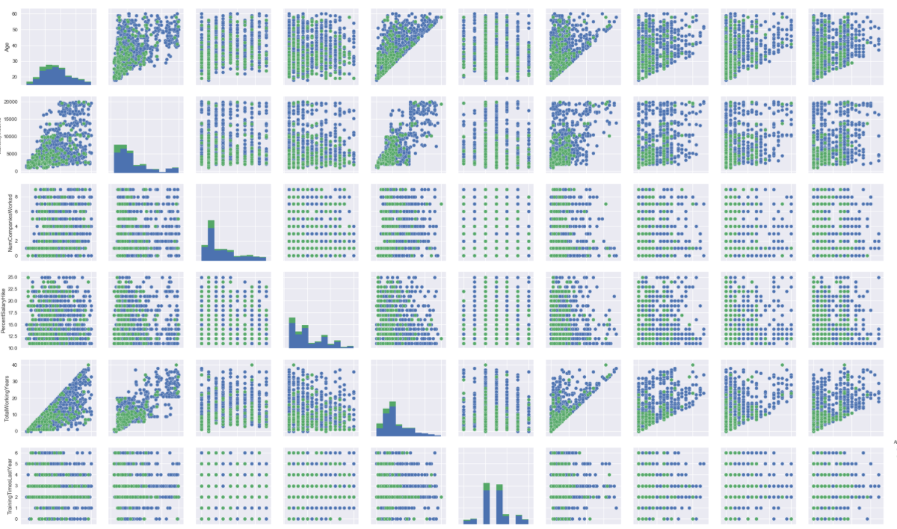

```
# 数值型数据
num_cols = ['Age', 'MonthlyIncome', 'NumCompaniesWorked', 'PercentSalaryHike', 'TotalWorkingYears', 'TrainingTimesLastYear',
           'YearsAtCompany', 'YearsInCurrentRole', 'YearsSinceLastPromotion', 'YearsWithCurrManager']
# 类别型数据
# 所有类别型数据
# cat_cols = ['BusinessTravel', 'Department', 'EducationField', 'Gender', 'JobRole', 'MaritalStatus', 'Over18', 'OverTime']
```


## 10. Assessment and Evaluation

### 10.1 Grade definition

​	Final grade（100）= Formative performance（50×100%）+ Summative performance（100×50%）

### 10.2 Formative assessment criteria

| **Item**              | **Score** | **Objective**                                                | **Description**                                              | **Comments**            |
| --------------------- | --------- | :----------------------------------------------------------- | ------------------------------------------------------------ | ----------------------- |
| Course project/coding | 30        | Evaluate if students can organize and  apply knowledge correctly. | Check code applications;3 times; 10 points  per check        |                         |
| Homework              | 10        | Evaluate the ability of self-study and  documentation        | 10 points for code fulfillment;                              |                         |
| Classroom interaction | 10        | Evaluate students’ attitude.                                 | 1 points /time                                               | No more than 10 points. |
| Classroom discipline  | 0         | Evaluate students’ attitude.                                 | Students who do activities not allowed  in class will be deduced 1 point one time. | No more than 20 points. |

### 10.3 Summative assessment

Exam method: Big Project   Total Score: 100 Points

| **Total Score: 100 Points**                                  |                                                              |                                                              |                                                              |
| ------------------------------------------------------------ | ------------------------------------------------------------ | ------------------------------------------------------------ | ------------------------------------------------------------ |
| **Test Case Coverage **  （25 Points）                       | **Test Case Details**  （25 Points）                         | **Tool usage** （25 Points）                                 | **Reporting** （25 Points）                                  |
| Be able to understand based knowledge. Include data analysis and display. | The code implementation design is appropriate for specific requirement. The objective  and steps are clear.  And a document is required. | Be able to use Pycharm and Jupiter. Package installation and version  control correctly. | Application can be described clearly. Status, severity and other  attributes are correct. |

# 

